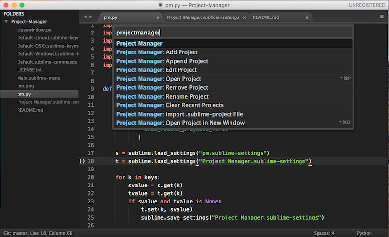
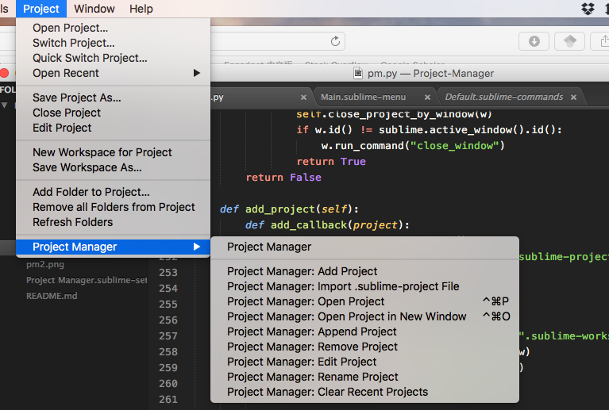

Project Manager for Sublime Text 3
===

Dont't have any idea what `*.sublime-project` and `*.sublime-workspace` are doing? Forget where the project files are? Project Manager will help organizing the project files for you. It is inspired by Atom's [Project Manager](https://atom.io/packages/project-manager).


If you like it, you could send me some tips via [paypal](https://www.paypal.com/cgi-bin/webscr?cmd=_donations&business=YAPVT8VB6RR9C&lc=US&item_name=tips&currency_code=USD&bn=PP%2dDonationsBF%3abtn_donateCC_LG%2egif%3aNonHosted) or [gratipay](https://gratipay.com/~randy3k/).

### Installation

You can install Project Manager via Package Control.

You can additionally add the following keybind in your user keybind settings file for "Open project in new window"

```
{
    "keys": ["super+ctrl+o"],
    "command": "project_manager", "args": {"action": "new"}
}
```

### Usage

To launch the Project Manager, you can either open it under the `Project` menu or via the command palette: `Project Manager: ...`.

To quick switch between projects, use the hotkey <kbd>Ctrl</kbd>+<kbd>Cmd</kbd>+<kbd>P</kbd> (<kbd>Ctrl</kbd>+<kbd>Alt</kbd>+<kbd>P</kbd> for windows/linux).

Project Manager also improves the shortcut <kbd>Ctrl</kbd>+<kbd>Shift</kbd>+<kbd>W</kbd> on Windows and Linux so that it will close the project when the window is closed. On OSX, it is the default behaviour.






Options are self-explained, enjoy!


#### Create new project

Just drag some folders to Sublime Text and then "Add Project". The project files will be created in `Packages/User/Projects/`.

#### Add existing projects to Project Manager

There are two ways to add existing projects to Project Manager. 
If you want to keep the project files (`.sublime-project` and `sublime-workspace`) in your project directory,

- Open your project file `.sublime-project`, and then use the import option of Project Manager. This tells Project Manager where `.sublime-project` is located and Project Manager will know where to look when the project is opened. In other words, you can put the `.sublime-project` file in any places.

If you want Project Manager manages the project files

- Move your `.sublime-project` and `.sublime-workspace` files in the project directory `Packages/User/Projects/`. You may need to update the project's folder information of the files.


#### Custom Projects directory

To use a different directory for your projects rather than `Packages/User/Projects/`, edit the following in package settings: Preferences -> Package Settings -> Project Manager

```
{
    "projects_path": ["path/to/custom/projects_dir"],
}
```


### License

Project Manager is MIT licensed.
